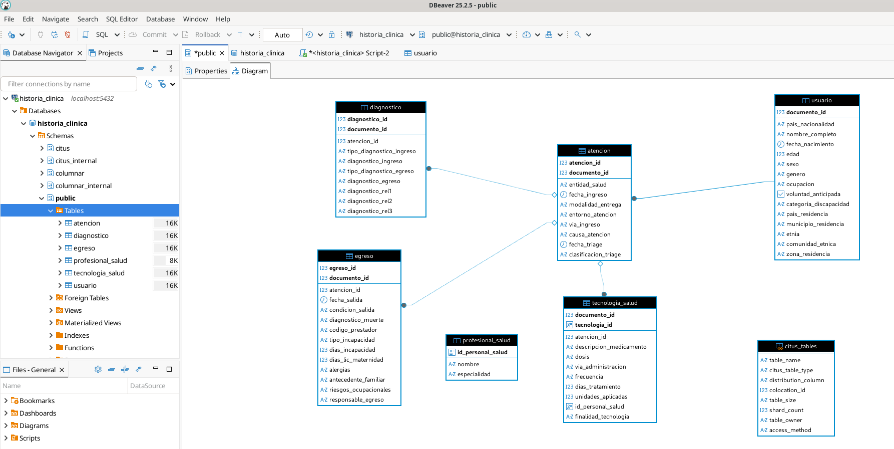
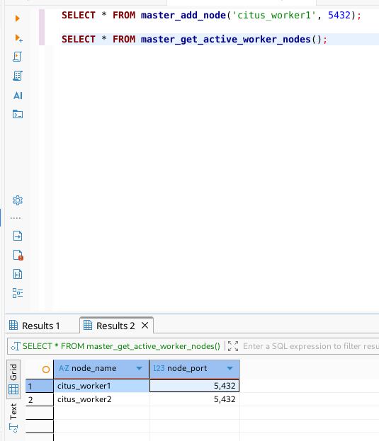

# 📚 Sistema de Historia Clínica Distribuida con Citus

## 📌 Descripción

Este proyecto implementa una base de datos distribuida utilizando PostgreSQL con la extensión Citus, permitiendo escalar horizontalmente mediante fragmentación (sharding) de datos en múltiples nodos.

El sistema gestiona información de historia clínica, incluyendo usuarios, atenciones, diagnósticos, egresos y tecnologías de salud, presentándose como una única base de datos lógica.

---

## 🧠 Concepto de Base de Datos Distribuida

Una base de datos distribuida es un:

Conjunto de múltiples bases de datos lógicamente relacionadas, dispersas en diferentes nodos físicos o ubicaciones geográficas y conectadas por una red, que se presenta al usuario como una sola unidad coherente.

---

## ⚙️ Características Clave

- Distribución de datos en múltiples nodos  
- Autonomía local de cada nodo  
- Transparencia para el usuario  

---

## ✅ Ventajas

- Escalabilidad horizontal  
- Tolerancia a fallos  
- Mejor rendimiento  

---

## ⚠️ Desventajas

- Mayor complejidad de diseño  
- Limitaciones en claves foráneas  
- Mayor dificultad en seguridad  

---

## 🧩 Tecnologías utilizadas

- PostgreSQL  
- Citus  
- Docker  
- Docker Compose  
- DBeaver  

---

## 🏗️ Arquitectura

El sistema está compuesto por:

- 1 Coordinator → citus_coordinator  
- 2 Workers → citus_worker1, citus_worker2  

Las tablas distribuidas utilizan como clave:

documento_id

---

## 🧱 Normalización de la Base de Datos

El modelo se encuentra normalizado hasta la Tercera Forma Normal (3FN).

- No hay redundancia de datos  
- Cada tabla representa una entidad  
- Los atributos dependen de su clave primaria  

Ejemplo:

- usuario → datos personales  
- atencion → eventos clínicos  
- diagnostico, egreso, tecnologia_salud → dependientes  

---

## 🧩 Modelo Entidad-Relación (MER)

Entidades principales:

- usuario  
- atencion  
- diagnostico  
- egreso  
- tecnologia_salud  
- profesional_salud  

Relaciones:

- usuario → atencion (1:N)  
- atencion → diagnostico (1:N)  
- atencion → egreso (1:N)  
- atencion → tecnologia_salud (1:N)  
- tecnologia_salud → profesional_salud (relación lógica)  

Nota:

Debido al uso de Citus, algunas relaciones no se implementan como claves foráneas físicas.

---

## 📊 Diagrama Entidad-Relación

---

## 🚀 Instalación y ejecución

### 1. Clonar repositorio

git clone https://github.com/jcontreras-dev/historia_clinica_distribuida_citus.git
cd historia-clinica-distribuida-citus  

---

### 2. Levantar servicios

docker compose -f docker-compose-citus.yml up -d  

---

### 3. Inicialización automática

Al iniciar el sistema:

- Se crea la base de datos  
- Se ejecuta schema_citus.sql  
- Se ejecuta insert_datos.sql  

---

### 4. Configuración del cluster

Ejecutar en DBeaver:

SELECT * FROM master_add_node('citus_worker1', 5432);

SELECT * FROM master_get_active_worker_nodes();

---

### 5. Verificación

SELECT * FROM master_get_active_worker_nodes();

---

## 🔍 Validación

SELECT * FROM citus_tables;

---

Puedes hacer consultas distribuidas directamente desde el coordinador:

SELECT * FROM usuario WHERE documento_id > 0;

---

## 📌 Conclusión

El sistema cumple con:

- Base de datos distribuida funcional  
- Modelo normalizado  
- MER estructurado  
- Distribución con Citus  
- Automatización con Docker  

---

## ✔ Cumplimiento

- Normalización ✔  
- MER ✔  
- Gráficos ✔  
- Sistema distribuido ✔  
